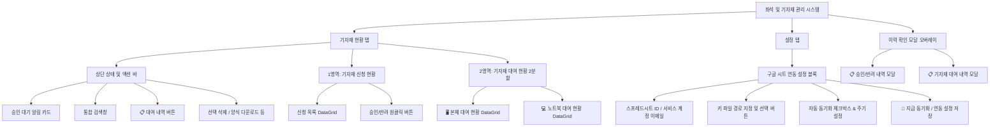

# 동서대학교 좌석 및 기자재 관리 시스템 - 기자재 현황 기능설계서

본 문서는 동서대학교 좌석 및 기자재 관리 시스템의 **기자재 현황 (Equipment Status) 탭** 및 이와 연동되는 **구글 스프레드시트 동기화 시스템, 승인/대여 이력 관리 기능**에 대한 상세 UI 구성, 데이터 모델, 그리고 비즈니스 로직을 체계적으로 서술한 기능설계서입니다.

---

## 1. 개요 (Overview)

* **시스템명**: 동서대학교 좌석 및 기자재 관리 시스템 (WPF 데스크톱 애플리케이션)
* **대상 화면**: 기자재 현황 관리 탭 (`TabEquipment`), 설정 탭 (`TabSettings`) 내 구글 시트 연동 영역, 이력 관리 모달 오버레이 2종
* **주요 목적**: 
  - 구글 폼 API(Google Sheets API v4)를 사용하여 원격에 저장된 기자재, 상상Lab, 캐비닛 사용 신청 데이터를 실시간/주기적으로 조회 및 동기화합니다.
  - 중복 신청 방지 키(`SourceKey`)를 적용하여 동일 데이터의 오처리 및 중복 승인을 원천 차단합니다.
  - 대여 중인 기자재(본체 및 노트북)의 상태(정상, 반납 임박, 연체)를 실시간 모니터링하고 신속 반납 및 되돌리기(Undo) 처리를 수행합니다.
  - 승인 완료 또는 반려된 건의 내역을 이력 로그에서 모니터링하고, 원클릭으로 대기 상태 복구 및 관련 자원(좌석, 캐비닛, 대여) 자동 회수 로직을 실행합니다.
  - 표준 엑셀 템플릿 파일 다운로드 및 XLSX 파일 데이터 고속 가져오기(MiniExcel) 기능을 지원합니다.

---

## 2. 화면 구성 및 UI 레이아웃 (UI Layout)

### 2.1. 상단 상태 및 액션 바 (기자재 현황 탭)
* **승인 대기 알림 카드**: 현재 승인 대기 중인 기자재 신청 건수를 요약 표시합니다 (`TxtEquipmentPendingCount`).
* **통합 검색창**: 학번, 이름, 전공(학과) 또는 기자재 종류를 입력하여 실시간 필터링할 수 있는 텍스트 상자(`TxtSearchEquipment`)를 제공합니다.
* **📋 대여 내역 버튼**: 클릭 시 과거 및 현재의 전체 기자재 대여 이력을 모니터링할 수 있는 오버레이 창(`ModalRentalHistory`)을 활성화합니다 (`BtnRentalHistory`).
* **기능 제어 버튼군**: 선택 삭제(`BtnDeleteSelectedRental`), 표준 엑셀 양식 다운로드(`BtnDownloadTemplate`) 등의 단추가 배치되어 있습니다.

### 2.2. [영역 1] 기자재 신청 현황
* **그리드명**: `GridEquipmentApprovals`
* **설명**: 구글 폼 API(스프레드시트 연동)를 통해 실시간 동기화된 기자재 대기 목록을 바인딩합니다.
* **표시 열(Columns)**:
  - 신청 일자 (`RequestDate` - yyyy-MM-dd HH:mm 형식)
  - 학번 (`StudentId`)
  - 이름 (`StudentName`)
  - 소속/전공 (`Department`)
  - 지도교수 (`Advisor`)
  - 상태 (`Status` - 기본값 "승인 대기")
  - 승인 처리 (원클릭 **승인** 및 **반려** 버튼 제공)

### 2.3. [영역 2] 기자재 대여 현황 (2분할 목록)
* **좌측 🖥️ 본체 (HP Z2 G9) 대여 현황**: 본체 사용 가능/사용 중 수량 통계 및 전용 엑셀 업로드, 본체 대여 목록(`GridQuestRentals`)을 제공합니다.
* **우측 💻 노트북 (HP OMEN 게이밍 노트북) 대여 현황**: 노트북 사용 가능/사용 중 수량 통계 및 전용 엑셀 업로드, 노트북 대여 목록(`GridLaptopRentals`)을 제공합니다.

### 2.4. [설정 탭] 구글 시트 연동 설정 영역
* **스프레드시트 ID**: 구글 폼의 응답 데이터가 기록되는 구글 스프레드시트의 고유 ID 입력 필드 (`TxtSpreadsheetId`).
* **서비스 계정 이메일**: API 호출에 사용되는 Google Cloud 서비스 계정 주소 자동 표시 (`TxtServiceAccountEmail`). 구글 스프레드시트 파일에 이 계정이 '뷰어' 권한으로 공유되어 있어야 합니다.
* **키 파일 위치**: API 인증을 위한 JSON 비공개 키 파일 경로 (`TxtKeyPath`). `📂 키 파일 선택...` 버튼을 통해 수동 지정할 수 있습니다.
* **자동 동기화 설정**: 타이머를 기반으로 동기화 백그라운드 작업을 실행할지 여부(`ChkPollingEnabled`)와 폴링 주기(`TxtPollingInterval` - 초 단위)를 구성합니다.
* **동기화 액션**: `🔄 지금 동기화` (`BtnSyncNow`) 및 `💾 연동 설정 저장`을 통해 로컬 설정 파일 `%APPDATA%\SeatManagerApp\settings.json`에 저장 및 즉시 동기화가 가능합니다.

### 2.5. 이력 관리 모달 오버레이 (Modals)
1. **승인/반려 내역 확인 모달 (`ModalApprovalHistory`)**:
   - 상상Lab 탭의 `📋 승인/반려 내역` 버튼 클릭 시 표시됩니다.
   - 모든 종류(상상Lab, 캐비닛, 기자재, 미분류)의 승인 및 반려 이력을 표 형식으로 조회하고, 실수로 처리한 내역을 대기 상태로 "되돌리기" 할 수 있는 기능을 탑재하고 있습니다.
2. **기자재 대여 내역 확인 모달 (`ModalRentalHistory`)**:
   - 기자재 현황 탭의 `📋 대여 내역` 버튼 클릭 시 표시됩니다.
   - 대여자 이름, 대여 기자재 명칭, 대여일, 반납 기한, 반납 여부(대여 중/반납 완료) 컬럼을 그리드로 출력합니다.

---

## 3. 세부 기능 명세 (Detailed Features)

### 3.1. 구글 스프레드시트 실시간 연동 (Google Sheets Sync)
* **API 연동**: `Google.Apis.Sheets.v4` 라이브러리를 사용하여 지정된 스프레드시트의 첫 번째 시트 행 데이터를 파싱합니다.
* **동적 헤더 매핑**: 컬럼의 물리적 위치에 의존하지 않고, 헤더 행의 문자열을 정규화(공백 및 특수문자 제거 후 소문자 변환)하여 필요한 정보(이름, 학번, 소속, 연락처, 희망공간 등)를 자동으로 매핑합니다.
* **중복 신청 방지**: 타임스탬프, 학번, 신청 공간을 결합한 `SourceKey` (`{Timestamp}|{StudentId}|{Space}`)를 자동 생성하고 메모리 해시셋에 기록하여 중복 유입을 방지합니다.
* **공간 분류 자동화**: 구글 폼의 신청 공간 텍스트 내 키워드를 분석하여 앱 내 `TabType`("상상Lab", "캐비닛", "기자재")으로 매핑하며, 분류가 불가능한 경우 "미분류" 탭타입으로 분류합니다.

### 3.2. 구글 폼 신청 건 승인/반려 로직
* **승인 프로세스 (`BtnApproveRequest_Click`)**:
  1. 신청 학생 정보를 학생 마스터 데이터베이스(`_masterStudents`)에 등록하거나 기존 기록을 최신 정보로 갱신합니다.
  2. 신청의 상태를 "승인 완료"로 변경하고 대기 목록(`_approvals`)에서 제외한 뒤, 히스토리 목록(`_approvalHistory`)으로 이관합니다.
  3. **신청 구분별 특화 로직**:
     - **상상Lab / 캐비닛**: 대시보드의 빈 좌석을 탐색하여 마스터 학생의 복사본을 착석시킵니다 (대학생/대학원생 여부에 따른 좌석 고정 조건 체크).
     - **캐비닛**: 추가로 비어있는 보관함(1~48번)을 탐색하여 대여 시작일로부터 1개월간 사용 권한을 부여하고 배정 맵에 등록합니다.
     - **기자재**: 신규 대여 아이템(`RentalItem`)을 생성하여 활성 대여 목록(`_rentals`)에 추가하고, 동시에 대여 내역 목록(`_rentalHistory`)에도 보존합니다. 대여 기간은 기본 7일로 계산됩니다.
  4. 처리가 완료되면 관련 탭과 좌석 그리드를 리바인딩합니다.
* **반려 프로세스 (`BtnRejectRequest_Click`)**:
  1. 신청 건의 상태를 "반려"로 지정하고 신청 대기 목록에서 이력 목록(`_approvalHistory`)으로 이관합니다.

### 3.3. 승인/반려 내역 복구 (Undo / Restore)
* **되돌리기 프로세스 (`BtnRestoreFromHistory_Click`)**:
  - 이미 완료된 내역(승인 완료 또는 반려)을 다시 "승인 대기" 상태로 되돌립니다.
  - **자원 자동 회수**: "승인 완료" 건을 되돌릴 때 발생할 수 있는 데이터 정합성 문제를 방지하기 위해 다음 회수 처리가 자동 실행됩니다.
    - **상상Lab**: 대시보드 좌석에 배치된 해당 학생을 강제 퇴실 처리하고 고정을 해제합니다.
    - **캐비닛**: 배정된 캐비닛 정보를 제거하고, 대시보드 좌석에서도 학생 배정을 취소합니다.
    - **기자재**: 활성 대여 목록(`_rentals`)에서 해당 학생의 대여 항목을 완전히 제거합니다.
  - 복구된 신청 데이터는 다시 각 승인 탭의 대기 목록에 복원되며 상태 뱃지가 갱신됩니다.

### 3.4. 대여 기자재 반납 처리 및 경보 시스템
* **반납 실행 (`BtnReturnEquipment_Click`)**:
  - 활성 대여 DataGrid 내 반납 버튼 클릭 시 확인 메시지박스를 팝업한 뒤, 해당 대여 정보의 `IsReturned` 필드를 `true`로 설정하고 실제 반납 일자(`ReturnDate`)를 시뮬레이션 일자로 마킹합니다.
  - 안전 조치로 활성 대여 목록에서 제외된 건은 LIFO 스택(`_rentalUndoStack`)에 임시 저장되어 실수로 반납 처리 시 되돌리기를 지원합니다.
* **상태 시각화 경보**:
  - 시스템 시뮬레이션 기준일자(2026-07-16) 대비 반납 예정일(`DueDate`)을 비교하여 상태 표시등(Ellipse) 색상을 제어합니다.
  - **초록색 (정상 대여중)**: 잔여 기한이 7일보다 많이 남은 상태
  - **주황색 (반납 임박)**: 미반납 상태이면서 잔여 기한이 7일 이하인 상태 (`IsWarning = true`)
  - **빨간색 (연체)**: 예정일이 시스템 시뮬레이션 일자보다 과거인 상태 (`IsOverdue = true`)

---

## 4. 데이터 모델 정의 (Data Entities)

### 4.1. ApprovalRequest (신청 정보 엔티티)
| 속성명 (Property) | 타입 (Type) | 설명 | 비고 |
| :--- | :--- | :--- | :--- |
| `StudentName` | string | 신청 학생 이름 | |
| `StudentId` | string | 신청 학생 학번 | |
| `Department` | string | 소속 학과 | |
| `Advisor` | string | 지도교수 | |
| `Email` | string | 이메일 주소 | |
| `Phone` | string | 연락처 | 구글 폼 연동 수신 |
| `TabType` | string | 신청 구분 | "상상Lab" \| "캐비닛" \| "기자재" \| "미분류" |
| `EquipmentType` | string | 신청 기자재 종류 | 기자재 신청 시에만 기록 |
| `RequestDate` | DateTime | 신청서 등록 일자 | |
| `Status` | string | 처리 상태 | "승인 대기" \| "승인 완료" \| "반려" |
| `PlanUrl` | string | 학업/프로젝트 계획서 파일 링크 | 구글 폼 연동 수신 |
| `Note` | string | 기타 의견 및 건의 사항 | 구글 폼 연동 수신 |
| `SourceKey` | string | 구글 폼 연동 고유 중복방지 키 | {Timestamp}\|{StudentId}\|{Space} |

### 4.2. RentalItem (기자재 대여 정보 엔티티)
| 속성명 (Property) | 타입 (Type) | 설명 | 비고 |
| :--- | :--- | :--- | :--- |
| `Id` | Guid | 대여 고유 키 | Primary Key |
| `StudentName` | string | 대여자 이름 | |
| `StudentId` | string | 대여자 학번 | |
| `Department` | string | 소속 학과 | |
| `YearLevel` | string | 학년 | 예: "3학년" |
| `Phone` | string | 연락처 | |
| `Advisor` | string | 지도교수 | |
| `EquipmentType` | string | 대여 기자재 명칭/종류 | 예: "HP OMEN 게이밍 노트북" |
| `Quantity` | int | 대여 수량 | 기본값: 1 |
| `ExtraItems` | string | 추가 대여물품 명칭 및 수량 | |
| `Location` | string | 사용 장소 | 기본값: "DSU 창의공간" |
| `Purpose` | string | 사용 목적 | 기본값: "개인 실습" |
| `RentalDate` | DateTime | 대여 시작 일자 | |
| `RentalPeriodDays` | int | 대여 기간 (일) | 기본값: 7일 |
| `DueDate` | DateTime | 반납 예정 일자 | `RentalDate` + `RentalPeriodDays` |
| `ReturnDate` | DateTime? | 실제 반납 처리 일자 | 미반납 시 Null |
| `IsReturned` | bool | 반납 완료 여부 | |
| `Remarks` | string | 특이 사항 및 특기 사항 | |
| `IsOverdue` | bool | 연체 여부 | `DueDate` < 시스템 기준일자 시 True |
| `IsWarning` | bool | 반납 임박 여부 | 잔여 기한이 7일 이하 시 True |

---

## 5. 예외 및 연동 안전 조치 (Exception & Safety)

1. **구글 API 네트워크 예외 처리**: 구글 시트 데이터 조회 중 403 Forbidden(시트 권한 공유 누락), 404 Not Found(ID 불일치) 또는 기타 네트워크 단절 상황 발생 시 애플리케이션 다운을 방지하기 위한 안전 예외처리(`try-catch`) 블록을 구현하고 텍스트 경고(`TxtSyncStatus`) 및 다이얼로그를 통해 실시간 피드백을 전달합니다.
2. **이력 원복 시 데이터 정합성 보장**: 승인 완료 이력을 취소(되돌리기)할 때, 이미 대시보드 좌석에 배정되거나 사물함이 점유되어 있을 경우 연결된 메모리를 자동 추적하여 일괄 회수(Unseat 및 Remove)함으로써 논리적 불일치를 차단합니다.
3. **폴링 리소스 관리**: 윈도우 타이머(`DispatcherTimer`)를 활용하여 지정된 초 단위 간격으로 안전하게 쿼리하고, 동기화 진행 중(`_isSyncing == true`)에 사용자가 중복으로 단추를 입력하더라도 추가적인 API 호출을 차단하도록 락(Locking) 설계를 적용했습니다.
